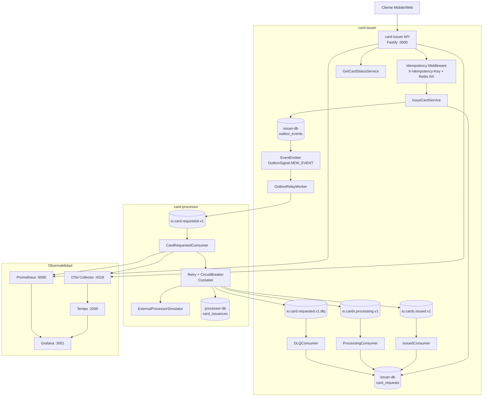
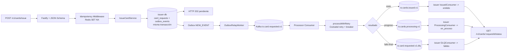
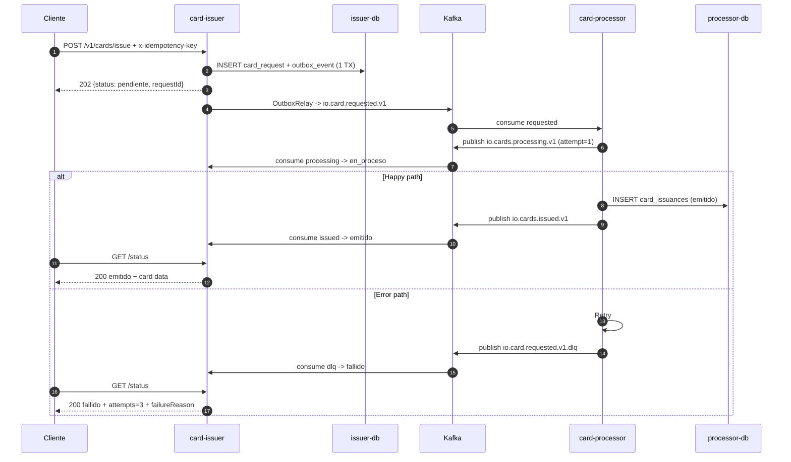

# IO Neobanco 

## Reto

Implementar un sistema de emisión de tarjetas VISA para IO Neobanco (fintech peruana) usando arquitectura event-driven con Node.js, Kafka, PostgreSQL y Docker Compose.

**Restricción clave:** Un cliente solo puede tener UNA tarjeta activa. El sistema maneja la emisión de forma asíncrona con idempotencia garantizada.

## Solución propuesta

**`card-issuer`** (API REST):
- Recibe solicitudes de emisión, genera `requestId` internamente (UUID v4)
- Persiste solicitud + evento outbox en una transacción atómica
- Responde `202 Accepted` inmediatamente
- Outbox Relay publica eventos a Kafka asíncrónamente
- La idempotencia del POST se valida con `x-idempotency-key` y Redis (`SET NX`)

**`card-processor`** (Consumer Kafka):
- Consume eventos de solicitud, simula procesamiento externo
- Implementa **retry exponencial** (1s, 2s, 4s) + **circuit breaker** para resiliencia
- Publica eventos de éxito (`issued`) o DLQ en caso de fallo tras 3 reintentos

**Aporta:**
- Idempotencia real en el servicio (`x-idempotency-key` + Redis NX)
- Resiliencia ante fallos (Outbox Pattern, Circuit Breaker, Retry, DLQ)
- Observabilidad (Prometheus + Grafana + Tempo/OTel, trazabilidad con X-Trace-ID)
- Hexagonal Architecture completa (application = casos de uso, infrastructure = adaptadores)

### Diagrama N2 del C4



### Arquitectura de Alto Nivel



### Flujo Happy Path + Error Path



### Endpoints de la API

| Método | Ruta | Descripción | Response |
|---|---|---|---|
| POST | `/v1/cards/issue` | Solicitar emisión | 202, 409, 422, 429 |
| GET | `/v1/cards/:requestId/status` | Consultar estado | 200, 404 |
| GET | `/health` | Health check | 200, 503 |
| GET | `/metrics` | Prometheus (9091) | 200 |

📄 **Documentación Swagger:** [http://localhost:3000/docs](http://localhost:3000/docs)
📋 **OpenAPI Spec:** `docs/swagger/openapi.yaml`

---
## Estructura de carpetas

```
io-yape/
├── docker-compose.yml ← single source of truth
├── docs/swagger/openapi.yaml
├── README.md ← this file
├── card-issuer/
│   ├── src/
│   │   ├── application/services/ ← IssueCardService, GetCardStatusService
│   │   ├── domain/ ← CardRequest (aggregate), CardStatus (enum), events, ports
│   │   ├── infrastructure/ ← HTTP routes, DB repos, Kafka consumers, KafkaEventPublisher
│   │   └── index.ts ← bootstrap
│   ├── tests/
│   │   ├── unit/ ← domain + services
│   │   ├── integration/ ← endpoint contracts
│   │   ├── e2e/ ← flows + observability
│   │   └── support/ ← in-memory repo mock
│   ├── migrations/init.sql
│   └── Dockerfile ← multi-stage
├── card-processor/
│   ├── src/
│   │   ├── application/services/ ← ProcessCardIssuanceService
│   │   ├── domain/ ← CardIssuance, ports (IExternalProcessor)
│   │   ├── infrastructure/ ← Kafka, DB, external adapter
│   │   ├── shared/ ← RetryEngine, CircuitBreaker
│   │   └── index.ts ← bootstrap
│   ├── tests/
│   │   ├── unit/ ← domain + resilience (retry, circuit breaker)
│   │   └── e2e/ ← end-to-end flows
│   ├── migrations/init.sql
│   └── Dockerfile ← multi-stage
├── prometheus/ ← prometheus.yml
├── grafana/ ← provisioning + datasources
└── otel/ ← otel-collector.yaml
```

---

## Ejecución del proyecto

### Requisitos previos
- Docker + Docker Compose
- Node.js 20+

### Levantar en local

```bash
cd io-yape

# 1. Levantar infraestructura
docker compose up -d

# 2. Verificar salud
docker compose ps
curl http://localhost:3000/health
```

### Prueba rápida (curl)

```bash
# 1. Emitir tarjeta
REQUEST_ID=$(curl -s -X POST http://localhost:3000/v1/cards/issue \
  -H "Content-Type: application/json" \
  -H "x-idempotency-key: quick-demo-1" \
  -d '{
	"customer": {
	  "documentType": "DNI",
	  "documentNumber": "12345678",
	  "fullName": "Jose Perez",
	  "birthDate": "02/03/2000",
	  "email": "jose@example.com"
	},
	"product": { "type": "VISA", "currency": "PEN" },
	"forceError": false
  }' | jq -r '.requestId')

echo "Request ID: $REQUEST_ID"

# 2. Esperar procesamiento (2-3s happy path)
sleep 3

# 3. Consultar estado
curl -s http://localhost:3000/v1/cards/$REQUEST_ID/status | jq .

# Esperado: status: "emitido"
```

---

## Observabilidad

| Herramienta | URL | Credenciales |
|---|---|---|
| Grafana | http://localhost:3001 | admin / admin |
| Prometheus | http://localhost:9090 | — |
| Tempo | http://localhost:3200 | — |
| Swagger UI | http://localhost:3000/docs | — |
| card-issuer metrics | http://localhost:9091/metrics | — |
| card-processor metrics | http://localhost:9093/metrics | — |

**Traceabilidad:**
- `X-Trace-ID` header propagado en todas las solicitudes
- Correlación end-to-end en logs, métricas y trazas OTEL exportadas a Tempo
